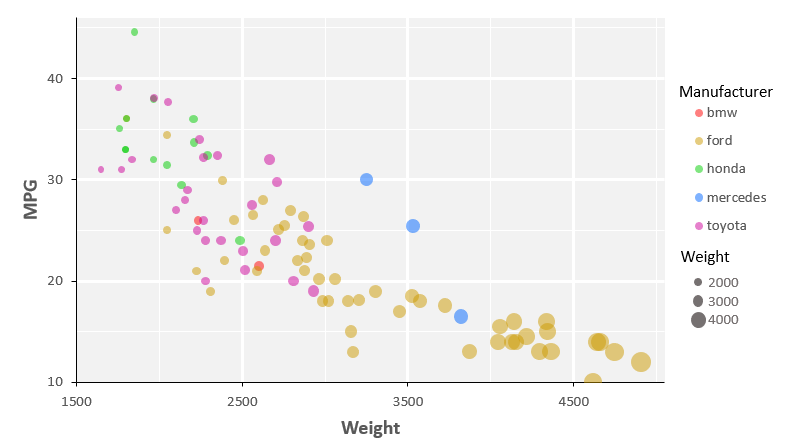
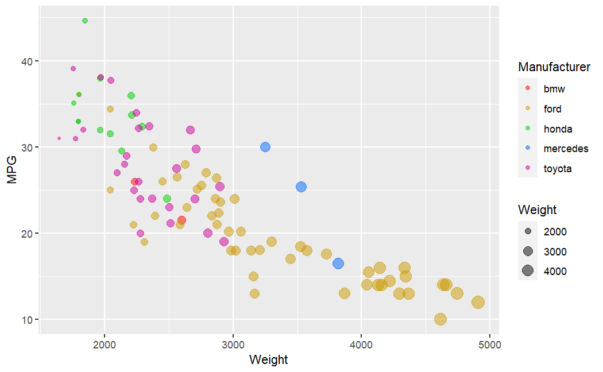
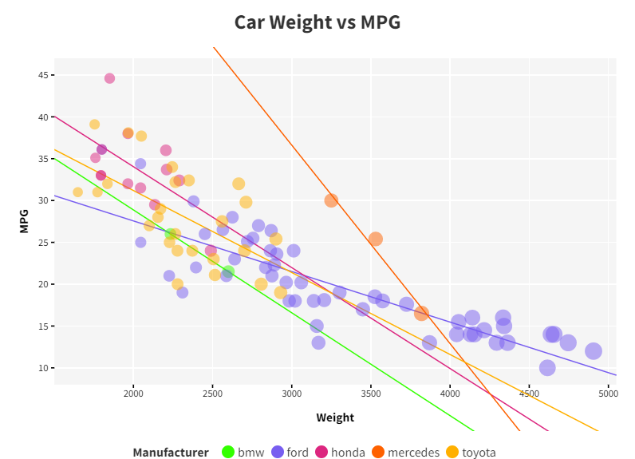
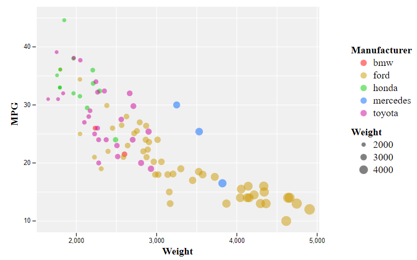

# 02-DataVis-5ways

# Assignment 2 - Data Visualization, 5 Ways  

Jules Cazaubiel
===

# Introduction

For each visualization, I started by creating the closest replica to the original visualization I could manage before improving it. This lead to me having two files (and thus two images) for each tool - a replica and an improved version.

# Excel

I started by using the excel bubble plot function to create the first plot and be able to link circle size to the Weight value. In order to change the color of the circles depending on the manufacturer, I grouped the data by manufacturer and created separate data series for each group. This allowed me to plot them on the same graph while keeping the colors distinct. I tried to recreate the colors of the original graph. Since excel didn't seem to support adding a second legend for the Weight, I added one manually by inserting appropriately sized circles and corresponding text to the side of the graph. Finally, the formatting of the background and the axes was performed by modifying parameters in the Options tab. I wasn't able to start the axes at a different value than the first tick mark, so the axes start ad slightly different values that the original.

As excel is fairly limited in terms of interaction and other customizations that I felt would add to the visualization, I decided to keep my improvements simple. I simply changed the colors to a colorblind accessible palette (created using the following website: https://davidmathlogic.com/colorblind/#%2333FF00-%23785EF0-%23DC267F-%23FE6100-%23FFB000) and added a title. 

Excel is easy to use and is very guided, so modifying parameters to achieve what I wanted in it was relatively easy but some aspects of it were restrictive. Some things I had to look for a little more in depth, like how to create multiple series, but overall it wasn't too bad. 

Note: the same color palettes were used for all following visualizations.

# Seaborn (Python + Jupyter Notebook)

I decided to use Jupyter Notebook to code this visualization, because it is easy to use and I enjoy the notebook aspect of it (multiple chunks of code and their outputs clearly separated).

Seaborn is a visualization library based on the matplotlib library. It adds more customization options, and is fairly simple to use. To recreate the graph, I used the seaborn scatterplot function. Various other functions were used to modify the appearance of the graph, such as making major and minor gridlines appear, or setting tick marks. However, Seaborn did not offer any function I could find to change the weight intervals displayed in the legend, and I was unable to match the original visualization.

In order to improve on the design using seaborn, I found my options to be limited. I once more updated the color palette to be colorblind friendly and added a title.

Python is the programming language I am probably most comfortable with, and while I wasn't familiar with seaborn, it is well documented. This made finding ways to achieve what I wanted achievable with a little research.

# ggplot2 (R and R markdown)

I used R markdown to code this visualization, once again because I enjoy having my code in a notebook and having multiple chunks of code displayed easily and separately.

I used ggplot2, a popular plotting library for R. Using the ggplot function and a few other cosmetic ones made it incredibly easy to replicate the original plot. 

In order to improve the plot, I once again added a title and updated the color scheme. However, I found that I have more freedom using ggplot. As R is usually used for statistical purposes, it was easy to plot regression lines for each manufacturer using geom_smooth(). As that crowded the plot however, I decided to split the graph into 5 individual ones using facet_wrap() and increased the size of the circles, since the resulting plots had more space. As each plot was labelled with the name of the corresponding manufacturer, I decided to remove the Manufacturer legend because it felt redundant. I then moved the Weight legend in the empty space on the bottom right of the graph, to make it more compact.

Even though I had never used ggplot before, it was surprisingly easy to use at first. Some of the more obscure functions however (such as how to get rid of the Manufacturer legend) required more in depth research.

# Flourish

Flourish is an online tool used to make visualization of datasets easy. It allows the user to input their data and then play with different setting to change the visualization of said data. As I was entirely dependent on the parameters I could change in Flourish, some aspects of the original plot were not reproduced.

I used the Scatter template and manually updated which columns of the dataset to use for X, Y, size, and color. I then was able to just go into the settings for the background, the axis, or the points and manually change them so they fit the original visualization as much as possible. However, I wasn't able to change the location of the Manufacturer legend (it could either be above or below the graph, not to the side) not could I add a secondary legend for the Weight. I was also unable to add minor gridlines between the major ones. However, Flourish is by nature interactive, and information can be see when hovering over a point.

Fkourish also didn't allow me to download the HTML version of the visualization, so I only have an image to show for it, but the live visualization can be found here: 
https://public.flourish.studio/visualisation/8646932/

As Flourish didn't really offer much freedom in customization, I added a title and changed the color palette. I also added trendlines for each individual Manufacturer. Even though they are a little messy when looking at all the manufacturers together, the user can click on the legend to select only one, making it easier to see. 
The live visualization can be found here: https://public.flourish.studio/visualisation/8678450/

Flourish was the easiest to use, but also the most restrictive, which makes sense when looking at how it is organized. 

# D3

D3 is a javascript library used to create highly customizable and interactive visualizations. In order to recreate the graph in D3, I used a wide variety of different functions to create and customize every element I needed, which would make it too long of a list to have here. I did use quite a few tutorials, however I only ever adapted what I needed from each one and merged it into my own project, because I usually ran into issues that required 2 to 3 different sources to solve. Despite these problems, I managed to recreate the graph quite accurately, as seen below.

In order to improve it, I once more added a title and modified the color palette. Additionally, I made the graph interactive, so the user could get more information out of it. Hovering over a circle makes it more opaque so it stands out more, and a tooltip displays its data nearby. I added what type of car the circle represented in this tooltip, because it adds one more level of information, and I also listed how many cars were present for each Manufacturer in the legend. 

D3 is definitely the most complicated of all the tools I used, mostly because it is the newest to me but also because you need to do absolutely everything in it. There is no wrapper function to create a graph easily like in seaborn, you have to do everything yourself. However, this is also what makes it the most customizable and potentially interactive.

## Technical Achievements
- **Proved P=NP**: Using a combination of...
- **Solved AI Forever**: ...

### Design Achievements
- **Re-vamped Apple's Design Philosophy**: As demonstrated in my colorscheme...
